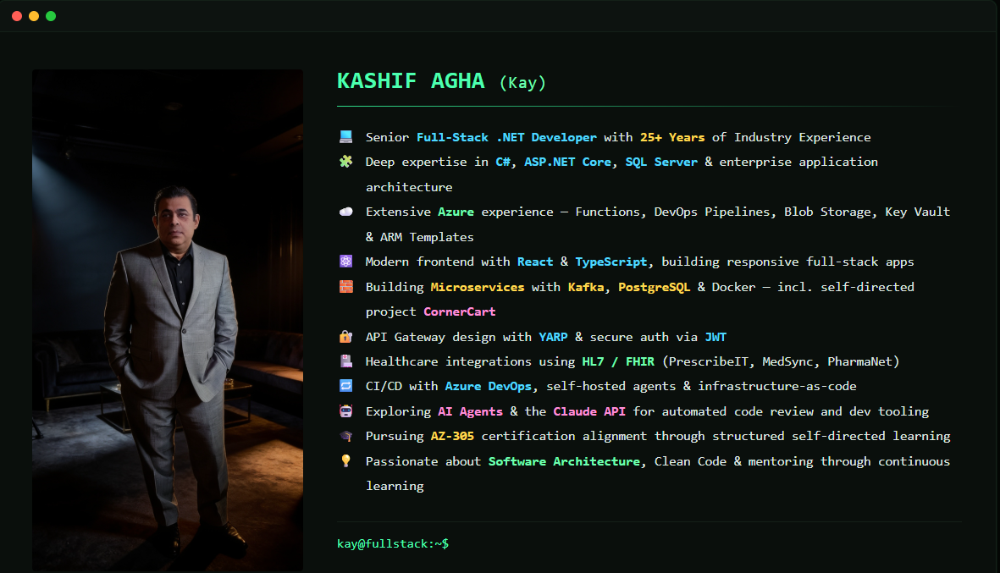

<h1 align="center">Hi 👋, I'm Kashif Agha (Kay)</h1>

Full Stack Developer • AI Engineer • Tech Architect • System Analyst • Business Analyst

---

# 🌐 Connect With Me

 

---

# 💻 Programming Languages

  

---

# 🎨 Frontend Development

  

---

# ⚙️ Backend Development

  

---

# 🗄️ Databases

  
    
  &nbsp;
  

---

# ☁️ DevOps & Cloud

  

---

# 🛠️ Tools & IDEs

  

---

# 🤖 AI & Data Technologies
- 🧮 Data Structures & Algorithms (DSA)
- 🧠 Artificial Intelligence (AI)
- ⚡ Model Context Protocol (MCP)
- 📚 Retrieval-Augmented Generation (RAG)
- 🕸️ GraphRAG
- 📊 Data Analytics
- 📈 Power BI
- 🧩 Large Language Models (LLMs)
- 🔗 LangChain
- 🌐 LangGraph

---

# 💬 Quote

> **"Code is transient, but a solid system architecture outlives the frameworks it was built on."**

---
Let's build something amazing together!
